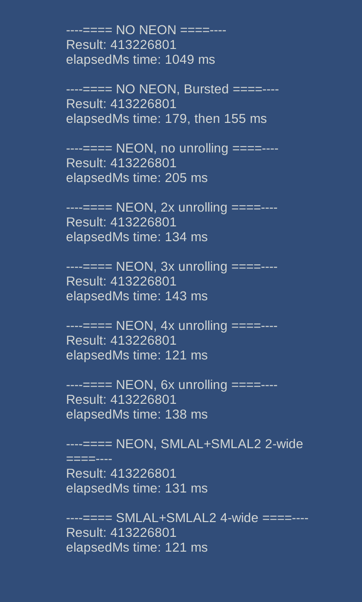
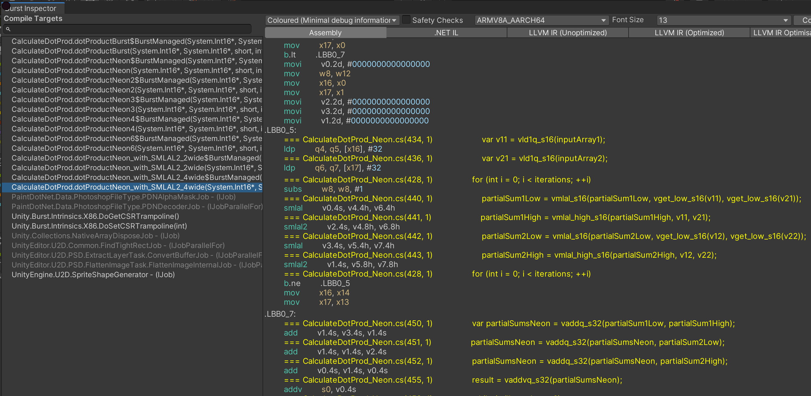

# NeonIntrinsics-Unity
This repository shows basic usage of Burst C# Neon intrinsics available in Unity. The code is equivalent to that written in C in this repo: https://github.com/Over17/NeonIntrinsics-Android/

## Description
Please refer to https://github.com/Over17/NeonIntrinsics-Android/ for explanation of what is being calculated and how. The input data is absolutely the same as in the C version.
Here is the list of what was implemented:
- pure managed C# scalar version calculation
- absolutely same function as above, but bursted by just adding the [BurstCompile] attribute - this is a new option comparing to the C version
- using Neon intrinsics, same variations as in the C version: plain Neon; manual loop unrolling 2x, 3x, 4x, 6x; SMLAL+SMLAL2; SMLAL+SMLAL2, manually unrolled 2x
- there is no need for special code to run threads on big cores because Unity already does it by default for you
- generally, there's no need for warm-up code because loading a Unity app will clock up the CPU enough. However, some interesting finds are waiting below
- the outer loop (on 1000000 `trials`) was moved into the calculation function themselves, to avoid the cost of 1000000x P/Invoke and potentially allow for better optimizations. Overall, this is the expected way to do such calculations.

If you look at the code itself, it looks very similar to the C intrinsics version. This makes porting C Neon intrinsics code or writing C# Neon code for people familiar with C Neon code a relatively easy task.

## Interpreting the results
To compare the performance of Burst C# intrinsics to C intrinsics, the APK was run on the same device (Pixel 3XL). Here is the result screenshot:

When comparing to the results of a C intrinsics run, you can find that most cases are demonstrating absolutely equivalent performance, with the following exceptions:

1. The "No Neon" (pure managed C# scalar version) run is much slower in C# than in C. This function doesn't get any benefit of auto-vectorization by neither Burst nor clang/LLVM (in case of C). Interesting fact: the performance of this pure scalar implementation is 5 times slower than of simple Neon implementation, and 8 times slower than the most performant intrinsic version.
2. The performance of "No Neon, bursted" version is equivalent to "No Neon" (LLVM auto-vectorized) version in C. Basically, it shows that by default Burst delivers the same performance as code written in C and compiled by a default compiler for Android. NOTE: first run of a bursted function was some 20ms slower; profiler showed that the thread was waiting for some I/O to finish - likely loading - to be checked additionally.
3. The performance of "Neon, 2x unrolling" version is some 15% faster than that of a C version (!!). Checking further, I found out that the difference is caused by the "1000000 trials" loop being moved into the bursted function, while it's in the caller function in C. When I move the `trials` loop into the calculation function in the C version, the performance becomes equivalent. I don't have a clear explanation on why this is happening, likely some additional optimizations are being performed when the outer loop is in the calculation function. Overall, there is parity of C# and C performance in this case too.

Looking closely at the explanation above, I think it's valid to say that the performance of the function written in Burst C# Neon intrinsics is equivalent to one written in C intrinsics.

A nice addition to the user experience is the Burst inspector, which allows to check the IL, IR and assembly output of bursted functions without having to build and use any external tools:

It's easy to verify that the output code has the expected instructions using Burst inspector.

## Prerequisites
The project was created and built using Unity 2020.1.17f1 and Burst 1.5.0 pre4. I don't see any reason why it wouldn't work with a newer Unity or Burst version.

## License
Licensed under Apache 2.0 license.
